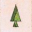

# Wallowa History Center Utilities
JavaScript and Python scripts and other one-offs for use in WHC projects.

### Favicons

Fashioned after the inset trees on the historic Forest Service headquarters that is our visitor center, this set of favicons can be used in any Wallowa History Center digital exhibits. 

 &nbsp; [Click here for the zipped set](https://github.com/wallowadigitalexhibits/whc-utilities/blob/main/favicons/favicons.zip?raw=true).

## json2csv

If the given JSON file is a list of objects which conform to the [GraphletJS](https://github.com/wallowadigitalexhibits/graphletjs) schema, separate the objects into sets by object label and produce a CSV file for each label.

## csv2json

Given a single CSV file, produce a list of objects in JSON that satisfy the [GraphletJS](https://github.com/wallowadigitalexhibits/graphletjs) schema.
