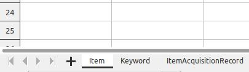

# xlsx2json

This utility converts a single `.xlsx` or `.ods` file into a JSON file compatible with the <a href="https://github.com/wallowadigitalexhibits/graphletjs">GraphletJS</a> schema. 

An example schema from our Wallowa History Center Archive App is saved in this repo as [archive-app.json](archive-app.json). 

## Usage

```
sudo apt install python3-pandas
./xlsx2json.py --schema=archive-app.json --existing-db=db.json --force=skip in.xlsx out.json
```

**Required Arguments**

The script takes a single `.xlsx` or `.ods` file, and outputs a `.json` file containing a list of node objects. 

This script will work for any schema. It requires a reference JSON database file containing, at minimum, label nodes corresponding to the names of each sheet in the input spreadsheet. 

For working with the Wallowa History Center's Archive App, the allowable node labels are: `Item`, `Keyword`, `ItemAcquisitionRecord`, `List`, and `User`. You can see the `archive-app.json` file for the bare minimum database file required.

To import items into a larger existing JSON database with many existing nodes, the label nodes must exist. The script will use those label nodes to create and add object nodes to the existing database. 



The spreadsheet must contain a header row. The first item in the header row must be the `id` to be stored in `core_props`. It will merge whatever columns exist into the reference schema node, leaving non-specified entries blank or in their default value. This means you can have a sheet called `Item` that only has `id`, `strTitle`, and `strDescription`, but still end up with a compliant `db.json` of nodes where the only values known are the title and description. 

If there are clashes with a node's id already existing, the script will print the list of clashing nodes for your inspection. 

If you then add a `--force=override` or `--force=skip` flag, the program will proceed and create the new file. This is handy for adding a single property to an existing database.

Every column which is prefixed by `rel`, i.e. a related node, must have its header cell include the destination type in a bracket. All related nodes headers need to have the related node type in brackets. If you have a sheet which references Item sheet without a Keyword sheet, but the `--extract-keywords` flag will create `Keyword` nodes for you.

The intent is to easily incorporate contributions from less technically-savvy folks into the master database for viewing in the Archive App. 


