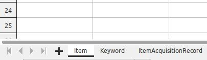

# xlsx2json

This utility converts a single `.xlsx` or `.ods` file into a JSON file compatible with the <a href="https://github.com/wallowadigitalexhibits/graphletjs">GraphletJS</a> schema. 

An example schema from our Wallowa History Center Archive App is saved in this repo as [archive-app.json](archive-app.json). 

## Usage

First, install `pandas`, probably by way of [Anaconda](https://docs.continuum.io/anaconda/install/).

Next,

```
pip install odfpy
./xlsx2json.py --schema=archive-app.json --existing-db=db.json --force=skip in.xlsx out.json
```

The script takes `.xlsx` and `.ods` files, and outputs a `.json` file containing a list of node objects. 

Each sheet in the spreadsheet must have the type of node, which must be one of the following: `Item`, `Keyword`, `ItemAcquisitionRecord`, `List`, `User`. You can see the `nodes.json` file for the resulting schema.



The spreadsheet must contain a header row. The first item in the header row must be the `id` to be stored in `core_props`. It will merge whatever columns exist into the reference schema node, leaving non-specified entries blank or in their default value. This means you can have a sheet called `Item` that only has `id`, `strTitle`, and `strDescription`, but still end up with a compliant `db.json` of nodes where the only values known are the title and description. 

This is also useful for merging into an existing database with the `--existing-db=file.json` flag. The script will attempt to add the new nodes to the existing database. If there are clashes with a node's id already existing, the script will print the list of clashing nodes for your inspection. 

If you then add a `--force=override` or `--force=skip` flag, the program will proceed and create the new file. This is handy for adding a single property to an existing database.

If you only have an Item sheet without a Keyword sheet, the `--extract-keywords` flag will create `Keyword` nodes for you.

The intent is to easily incorporate contributions from less technically-savvy folks into the master database for viewing in the Archive App. 


